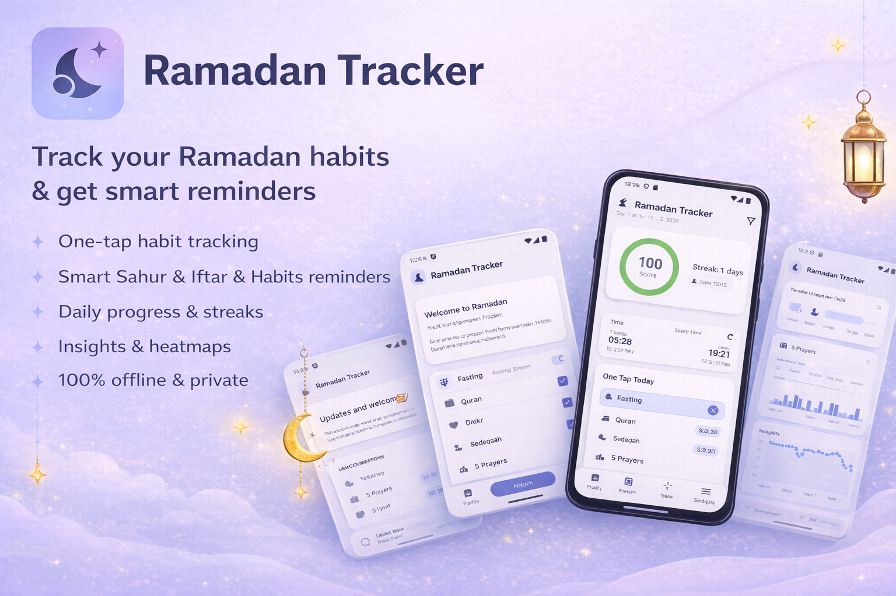

# Ramadan Tracker

Track your Ramadan habits and get smart reminders.



Premium Ramadan tracker and planner: yearly seasons, Autopilot Quran plan, Sahur/Iftar reminders, and local backup/restore.

## Features

- **One-tap habit tracking**: Fasting, Quran, Dhikr, Taraweeh, Sedekah, 5 Prayers
- **Smart reminders**: Sahur, Iftar, and goal reminders (Quran, Dhikr, Sedekah, Taraweeh) based on your location
- **Daily progress and streaks**: Completion score and streak counter
- **Insights and heatmaps**: Charts, heatmaps, and trends for Quran, Dhikr, and habits
- **Ramadan Autopilot**: Daily plan with Quran reading targets and catch-up suggestions
- **Yearly reusable**: Multiple Ramadan seasons (2025, 2026, etc.)
- **Backup and restore**: Export/import data as JSON
- **100% offline and private**: No account, no ads, no tracking; data stays on your device
- **Multi-language**: English and Indonesian

## Architecture

### Tech Stack

- **Flutter**: Cross-platform mobile framework
- **Riverpod**: State management
- **Drift**: SQLite database with type-safe queries
- **fl_chart**: Charts for insights

### Project Structure

```
lib/
├── app/                 # App configuration and main screen
├── data/
│   ├── database/        # Drift database schema, tables, DAOs
│   ├── providers/       # Riverpod providers
│   └── repositories/    # Data repositories
├── domain/
│   ├── models/          # Domain models
│   └── services/        # Business logic (autopilot, completion)
├── features/
│   ├── today/           # Today tab screen
│   ├── month/           # Month view screen
│   ├── plan/            # Autopilot plan screen
│   ├── insights/        # Insights/charts screen
│   └── settings/        # Settings screen
└── widgets/             # Shared UI components
```

### Database Schema

The app uses Drift (SQLite) with the following tables:

1. **ramadan_seasons**: Stores multiple Ramadan seasons
2. **habits**: Default habit definitions (fasting, prayers, quran, etc.)
3. **season_habits**: Per-season habit configuration
4. **daily_entries**: Daily tracking data
5. **quran_plan**: Quran reading plan configuration
6. **quran_daily**: Daily Quran pages read
7. **dhikr_plan**: Dhikr target configuration
8. **notes**: Reflection notes
9. **kv_settings**: Key-value settings

## Setup

### Prerequisites

- Flutter SDK >=3.0.0
- Dart SDK >=3.0.0

### Installation

1. Clone the repository:
```bash
git clone https://github.com/hndrwn-dk/ramadan-tracker.git
cd ramadan-tracker
```

2. Install dependencies:
```bash
flutter pub get
```

3. Generate Drift database code:
```bash
flutter pub run build_runner build --delete-conflicting-outputs
```

4. Run the app:
```bash
flutter run
```

## Usage

### First Launch

On first launch, the app will guide you through onboarding:
- Set up your Ramadan season (start date, number of days)
- Choose which habits to track (fasting, Quran, Dhikr, Taraweeh, Sedekah, I'tikaf)
- Configure goals (Quran pages/day, Dhikr target, Sedekah amount & currency)
- Set up prayer time reminders (Sahur & Iftar)

### Creating a New Season

1. Go to Settings > Season Management
2. Tap "Create New Season"
3. Enter label (e.g., "Ramadan 2025")
4. Select number of days (29 or 30)
5. The app will copy habit settings from the previous season

### Setting Up Autopilot

The Autopilot plan is configured during onboarding, but you can adjust it later:
1. Go to Settings > Goals
2. Configure:
   - Quran goal (1 Khatam / 2 Khatam / Custom pages per day)
   - Dhikr target (33/100/300/1000 per day)
   - Sedekah goal (optional, with currency selection)
3. View your daily plan in the Plan tab

### Quick Logging

The Today tab allows fast logging:
- Toggle boolean habits (fasting, Taraweeh, I'tikaf)
- Adjust count habits (Quran pages, Dhikr) with +/- buttons
- Use quick-add chips (+5, +10, +20 for Quran; +33, +100, +300 for Dhikr)
- Track Sedekah with currency support (IDR, SGD, USD, MYR)
- Write daily reflections

### Backup & Restore

1. Go to Settings > Backup & Restore
2. **Export**: Tap "Export Backup" to share your data as JSON
3. **Import**: Tap "Import Backup" to select and restore a JSON file

**Note**: Import will replace all existing data. Make sure to export before importing.

## Autopilot Algorithm

The Autopilot generates daily plans based on:

1. **Quran Planning**:
   - Default: 1 Juz/day = 20 pages/day
   - Calculates remaining pages and days
   - Suggests daily target with catch-up cap (max +5 pages/day)
   - Distributes reading across morning/day/night time blocks

2. **Time Allocation**:
   - Quran: ~1.5 minutes per page
   - Dhikr: ~0.02 minutes per count
   - Taraweeh: 20 minutes (fixed)

3. **Catch-Up Mode**:
   - If you miss days, increases daily target
   - Caps increase to prevent overwhelming targets (default +5 pages/day)
   - Shows warnings if completion becomes unlikely

## Completion Score

The completion score (0-100) is calculated as:
- Boolean habits: 1 if done, 0 if not
- Count habits: progress = min(value / target, 1)
- Score = average of all enabled habits × 100

## Development

### Running Tests

```bash
flutter test
```

### Building for Release

```bash
flutter build apk --release  # Android
flutter build ios --release  # iOS
```

### Database Migrations

To add a migration:
1. Update `schemaVersion` in `app_database.dart`
2. Add migration logic in `onUpgrade` callback
3. Regenerate code: `flutter pub run build_runner build`

## License

MIT License - see LICENSE file for details

## Contributing

This is a standalone app. For issues or feature requests, please open an issue in the repository.
