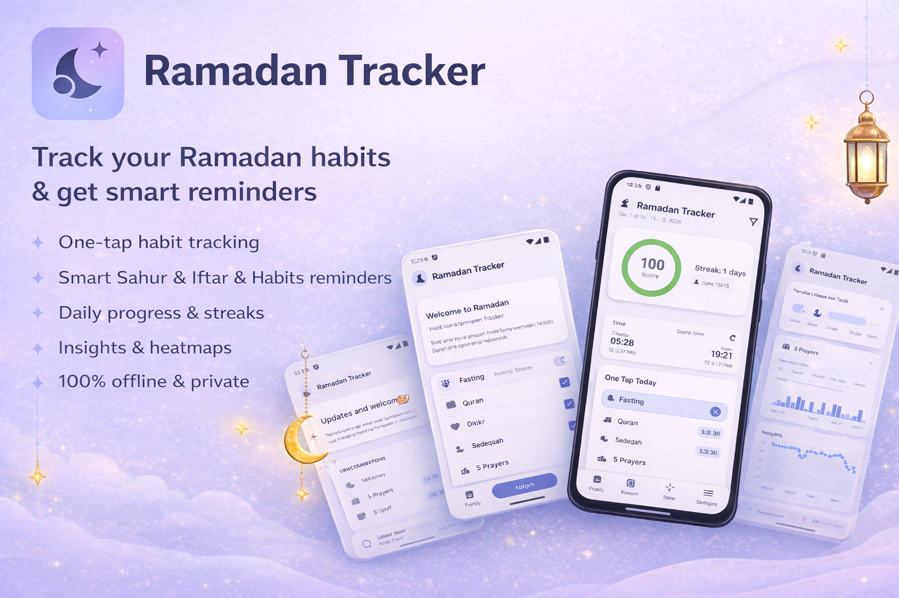

# Ramadan Tracker

Track Ramadan habits, sunnah fasting year-round, and worship obligations — with smart reminders and private local storage.



Premium companion for **Ramadan seasons** and **year-round ibadah**: one-tap logging, Autopilot Quran plan, Sahur/Iftar reminders, sunnah fast calendar, Zakat/Fidyah/Qadha, rich insights, and local backup/restore.

## Features

### Ramadan season

- **One-tap habit tracking**: Fasting (with excused reasons), Quran, Dhikr, Taraweeh (11 or 23 rakaat), Tahajud, Sedekah, 5 Prayers, I'tikaf
- **Unified fasting popup**: Ramadan and sunnah fasts share the same card UX — numbered options plus excuse chips (sick, haid, nifas, other)
- **Smart reminders**: Sahur, Iftar, and goal reminders (Quran, Dhikr, Sedekah, Taraweeh) based on your location
- **Daily progress and streaks**: Completion score, streak counter, and fair scoring for excused days (sick, haid, nifas)
- **Ramadan Autopilot**: Daily plan with Quran reading targets and catch-up suggestions
- **Month view**: 30-day calendar with completion rings, tracked dots, and Last 10 markers
- **Yearly reusable seasons**: Multiple Ramadan seasons (2025, 2026, …) with settings copied forward

### Sunnah fasting (year-round)

- **Sunnah tab**: Log sunnah fasts, qadha make-up fasts, and excused days outside Ramadan
- **Sunnah types**: Monday/Thursday, Ayyamul Bidh, Ashura, Shawwal, Arafah, and more — with Hijri-aware rules
- **Pre-Ramadan mode**: Before a season starts, **Month** and **Insights** show a sunnah fast calendar and charts instead of empty Ramadan views
- **During Ramadan**: Sunnah logging pauses; **Insights → Sunnah Fasts** tab still shows your pre-Ramadan sunnah history

### Zakat, Fidyah & Qadha

- **Calculators**: Zakat al-Fitr and Fidyah with multi-currency support (IDR, SGD, USD, MYR)
- **Qadha ledger**: Track owed vs paid make-up fast days
- **Charts & review**: Payment timeline, Zakat vs Fidyah breakdown, and period summaries in **Today**, **7 Days**, and **Season** insights
- **Payment history**: Full ledger with swipe-to-delete on the obligations screen

### Insights (Wawasan)

- **Today / 7 Days / Season**: Scores, trends, heatmaps, task analytics, and sedekah financial review
- **Sunnah insights**: Hero stats, 35-day heatmap, monthly/weekly bar charts, and breakdown by fast type
- **Season cards**: Sedekah, Zakat & Fidyah, mood/reflection, and task-level analytics
- **Post-Ramadan**: Season insights plus year-round sunnah summary for returning users

### Other

- **Android home widget**: Sunnah fasting summary on the home screen
- **Prayer times**: Location-based times (including Kemenag method for Indonesia)
- **Backup and restore**: Export/import all data as JSON
- **100% offline and private**: No account, no ads, no tracking; data stays on your device
- **Multi-language**: English and Indonesian

## App tabs

| Tab | Purpose |
|-----|---------|
| **Today** | Log today's habits during an active Ramadan season |
| **Month** | Ramadan calendar, or sunnah fast calendar before the season |
| **Plan** | Autopilot daily plan (Quran, Dhikr, time blocks) |
| **Sunnah** | Year-round sunnah/qadha logging; Ramadan focus card when season is active |
| **Insights** | Analytics — Ramadan tabs plus **Sunnah Fasts** during active Ramadan |
| **Settings** | Season, goals, reminders, appearance, backup |

## Architecture

### Tech stack

- **Flutter** — cross-platform mobile
- **Riverpod** — state management
- **Drift** — SQLite with type-safe queries
- **fl_chart** — charts for insights
- **home_widget** — Android sunnah widget

### Project structure

```
lib/
├── app/                 # App shell and bottom navigation
├── data/
│   ├── database/        # Drift schema, tables, DAOs
│   └── providers/       # Riverpod providers
├── domain/
│   ├── models/
│   └── services/        # Autopilot, completion, notifications, widgets
├── features/
│   ├── today/           # Today tab + Ramadan fasting sheet
│   ├── month/           # Month view (Ramadan or sunnah calendar)
│   ├── plan/            # Autopilot plan
│   ├── sunnah/          # Sunnah fasting, month view, Ramadan focus
│   ├── qadha/           # Zakat, Fidyah, Qadha + payment charts
│   ├── insights/        # Wawasan: scores, charts, obligations review
│   ├── settings/
│   └── onboarding/
├── l10n/                # English & Indonesian strings
└── widgets/             # Shared UI (habit toggles, icons, score ring)
```

### Database (main tables)

| Table | Purpose |
|-------|---------|
| `ramadan_seasons` | Multiple Ramadan seasons |
| `habits` / `season_habits` / `daily_entries` | Per-season habit config and daily logs |
| `quran_plan` / `quran_daily` | Quran Autopilot and daily pages |
| `sunnah_fasts` | Year-round sunnah and qadha fast entries |
| `qadha_ledger` | Zakat, Fidyah payments and qadha owed/paid |
| `notes` | Daily mood and reflection |
| `kv_settings` | Currency, goals, theme, locale |

## Setup

### Prerequisites

- Flutter SDK >= 3.0.0
- Dart SDK >= 3.0.0

### Installation

```bash
git clone https://github.com/hndrwn-dk/ramadan-tracker.git
cd ramadan-tracker
flutter pub get
flutter pub run build_runner build --delete-conflicting-outputs
flutter run
```

## Usage

### First launch

Onboarding walks you through:

- Ramadan season (start date, number of days)
- Habits to track and daily goals
- Prayer time reminders (Sahur & Iftar)

### Quick logging (Today)

- Toggle boolean habits; open **Fasting** for Ramadan status or excused reasons
- Adjust Quran/Dhikr with +/- and quick-add chips
- Log Sedekah in IDR, SGD, USD, or MYR
- Add daily reflection notes

### Sunnah fasting

- Open the **Sunnah** tab and tap a date on the calendar
- Choose: sunnah fast, qadha make-up, or excused (with reason chips)
- Before Ramadan, use **Month** and **Insights** for sunnah-only views

### Zakat & Fidyah

- **Sunnah** tab → **Zakat, Fidyah & Qadha**, or **Insights** → obligations cards
- Record payments; view charts and history on the obligations screen
- Open **View full breakdown** from Insights for period-specific review

### Backup & restore

**Settings → Backup & Restore** — export JSON before importing; import replaces all local data.

## Development

```bash
flutter test                    # Unit tests
flutter build appbundle --release   # Play Store AAB
```

Integration tests live under `integration_test/` (require a device/emulator).

Release AABs, Play Console copy, internal design notes, and helper scripts are **local only** (`bundles_release/`, `docs/`, `scripts/` are gitignored).

### Database migrations

1. Bump `schemaVersion` in `app_database.dart`
2. Add logic in `onUpgrade`
3. Run `flutter pub run build_runner build --delete-conflicting-outputs`

## License

MIT License — see [LICENSE](LICENSE).

## Contributing

Open an issue for bugs or feature requests. Pull requests welcome.
